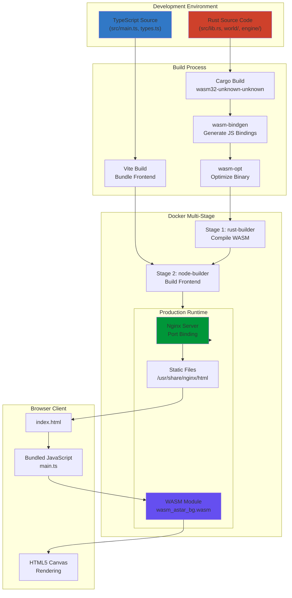

# Fullstack Rust for Sigmas

Welcome to an immersive journey through a production-ready, full-stack web application that combines the power of Rust, WebAssembly, TypeScript, Docker, and cloud deployment. This project demonstrates how modern systems engineering principles come together to create a high-performance, type-safe, and deployable web application.

## What You'll Learn

By studying this project, you'll gain deep understanding of:

- **Rust WebAssembly (WASM)**: How Rust code compiles to WebAssembly and runs in browsers at near-native speed
- **TypeScript Integration**: Type-safe communication between JavaScript and WebAssembly modules
- **Modern Build Systems**: Vite for frontend bundling and optimization
- **Containerization**: Multi-stage Docker builds for efficient, reproducible deployments
- **Web Server Configuration**: Nginx as a reverse proxy with security and performance optimizations
- **Cloud Deployment**: Render.com orchestration with dynamic port binding and health checks
- **System Architecture**: How all these pieces connect to form a cohesive, production-ready application

This isn't just a tutorial—it's a complete, deployable system that you can study, modify, and learn from. Every line of code serves a purpose, and every configuration file teaches you something about modern web development.

---

## High-Level Architecture

Before diving into the code, let's understand how the entire system fits together. This application follows a sophisticated architecture that separates concerns while maintaining tight integration between components.

### System Flow Diagram



### Request Flow

When a user visits your deployed application, here's what happens:

1. **Browser Request**: User navigates to `https://your-app.onrender.com`
2. **Render.com Load Balancer**: Routes request to your Docker container
3. **Nginx**: Receives request on dynamically-bound port (set via `$PORT` environment variable)
4. **Static File Serving**: Nginx serves `index.html` from `/usr/share/nginx/html`
5. **JavaScript Execution**: Browser loads and executes bundled TypeScript code
6. **WASM Initialization**: JavaScript loads and initializes the WebAssembly module
7. **Rust Execution**: WASM module runs Rust code (A* pathfinding algorithm)
8. **Canvas Rendering**: Rust calls back to JavaScript to render on HTML5 Canvas
9. **User Interaction**: Keyboard/mouse events flow from JavaScript → WASM → Rust → back to JavaScript for rendering

### Key Architectural Decisions

🧠 **Concept Break**: Why This Architecture?

- **Rust for Performance**: The A* pathfinding algorithm benefits from Rust's zero-cost abstractions and memory safety
- **WASM for Browser Execution**: Compiling Rust to WebAssembly allows near-native performance in the browser
- **TypeScript for Type Safety**: TypeScript ensures correct communication between JavaScript and WASM
- **Multi-Stage Docker**: Separates build dependencies from runtime, resulting in a tiny final image (~40MB)
- **Nginx for Production**: Lightweight, battle-tested web server with excellent performance characteristics
- **Render.com for Simplicity**: Platform handles SSL, scaling, and infrastructure management

---

## Backend (Rust)

The Rust backend is the computational heart of this application. It implements an A* pathfinding algorithm that finds optimal paths through a randomly generated tile-based world.

### Project Structure

The Rust codebase is organized into logical modules:

```
src/
├── lib.rs          # Main entry point, WASM bindings
├── world/
│   ├── mod.rs      # World state and A* algorithm
│   └── tile.rs     # Tile data structure
├── engine/
│   └── mod.rs      # Engine state, input handling, FPS tracking
├── browser/
│   └── mod.rs      # Browser API bindings
└── utils/
    └── mod.rs      # Utility functions (logging, random)
```

### Core Concepts

#### 1. WebAssembly Bindings with `wasm-bindgen`

The project uses `wasm-bindgen` to create seamless interoperability between Rust and JavaScript. Here's how it works:

```rust:src/lib.rs
use wasm_bindgen::prelude::*;

#[wasm_bindgen]
pub fn wasm_init(debug: i32, render_interval_ms: i32, window_width: u32, window_height: u32) {
    utils::log("Initializing Rust/WASM");
    // ... initialization code
}
```

⚙️ **Under the Hood**: The `#[wasm_bindgen]` attribute macro generates JavaScript bindings at compile time. When you call `wasm_init()` from TypeScript, it's actually calling a generated JavaScript function that marshals arguments, calls the WASM function, and marshals return values.

#### 2. Global State with `LazyLock` and `Mutex`

Rust's ownership system prevents global mutable state by default. For WASM applications that need to maintain state across function calls, we use `LazyLock` (Rust 2021) with `Mutex`:

```rust:src/lib.rs
use std::sync::{LazyLock, Mutex};

static WORLD_STATE: LazyLock<Mutex<WorldState>> = 
    LazyLock::new(|| Mutex::new(WorldState::new()));
static ENGINE_STATE: LazyLock<Mutex<EngineState>> = 
    LazyLock::new(|| Mutex::new(EngineState::new()));
```

🧠 **Concept Break**: Why `LazyLock` and `Mutex`?

- **`LazyLock`**: Initializes the value on first access (lazy initialization). This is perfect for WASM where we don't have a `main()` function that runs at startup.
- **`Mutex`**: Provides thread-safe access to mutable data. Even though WASM runs single-threaded, `Mutex` ensures Rust's borrow checker is satisfied when we need mutable access.

#### 3. The A* Pathfinding Algorithm

The core algorithm lives in `src/world/mod.rs`. A* is an informed search algorithm that finds the shortest path between two points:

```rust:src/world/mod.rs
pub fn calc_astar(&mut self) {
    // Open set: nodes to be evaluated
    // Closed set: nodes already evaluated
    // Uses heuristic (estimated distance) + actual cost
    // Always explores the most promising path first
}
```

💡 **Tip**: A* is optimal and complete—it always finds the shortest path if one exists, and it's more efficient than Dijkstra's algorithm because it uses a heuristic to guide the search.

#### 4. Calling JavaScript from Rust

Rust code can call JavaScript functions through `wasm-bindgen`:

```rust:src/lib.rs
#[wasm_bindgen]
extern "C" {
    #[wasm_bindgen(js_name = "js_draw_tile")]
    fn js_draw_tile(
        layer_id: i32,
        px: f64,
        py: f64,
        size: f64,
        ch: i32, cs: i32, cl: i32, ca: f32,
    );
}
```

This declares that a JavaScript function `js_draw_tile` exists and can be called from Rust. The actual implementation lives in TypeScript.

#### 5. Module Organization

The codebase follows Rust's module system:

- **`lib.rs`**: Main entry point, exports public WASM functions
- **`world/mod.rs`**: Game world state, tile management, A* algorithm
- **`engine/mod.rs`**: Input handling, FPS calculation, timing
- **`browser/mod.rs`**: Wrapper functions for browser APIs
- **`utils/mod.rs`**: Shared utilities (logging, random number generation)

### Rust Build Configuration

The `Cargo.toml` file defines the project:

```toml:Cargo.toml
[package]
name = "wasm-astar"
version = "0.1.0"
edition = "2021"

[lib]
path = "src/lib.rs"
crate-type = ["cdylib", "rlib"]

[dependencies]
wasm-bindgen = "0.2"
console_error_panic_hook = "0.1"

[profile.release]
lto = true          # Link-time optimization
opt-level = 's'     # Optimize for size
```

⚙️ **Under the Hood**: 
- **`crate-type = ["cdylib", "rlib"]`**: `cdylib` creates a dynamic library (WASM), `rlib` allows the crate to be used as a dependency
- **`lto = true`**: Link-time optimization reduces binary size and improves performance
- **`opt-level = 's'`**: Optimizes for size rather than speed (important for web delivery)

---

## Frontend (TypeScript)

The TypeScript frontend orchestrates the entire application lifecycle: loading WASM, handling user input, and rendering to the canvas.

### Type Safety with Interfaces

Before we even load WASM, we define strict types:

```typescript:src/types.ts
export interface WasmModule {
  memory: WebAssembly.Memory;
  wasm_init(debug: number, renderIntervalMs: number, windowWidth: number, windowHeight: number): void;
  tick(elapsedTime: number): void;
  key_down(keyCode: number): void;
  key_up(keyCode: number): void;
  mouse_move(x: number, y: number): void;
}

export interface Layer {
  ctx: CanvasRenderingContext2D;
  canvas: HTMLCanvasElement;
  setSize(width: number, height: number, quality: number): void;
  clearScreen(): void;
  drawRect(px: number, py: number, sx: number, sy: number, ch: number, cs: number, cl: number, ca: number): void;
  drawCircle(px: number, py: number, r: number, ch: number, cs: number, cl: number, ca: number): void;
  drawText(text: string, fontSize: number, px: number, py: number): void;
}
```

🧠 **Concept Break**: Why TypeScript?

TypeScript catches errors at compile time that would only surface at runtime in JavaScript. When working with WASM, type safety is crucial because:
- WASM functions have specific signatures
- Memory access must be correct
- Type mismatches cause cryptic runtime errors

### WASM Module Initialization

The initialization process is carefully orchestrated:

```typescript:src/main.ts
const init = async (): Promise<void> => {
  // 1. Set up JavaScript functions that Rust will call
  const wasmImports = getWasmImports();
  
  // 2. Make functions globally available for wasm-bindgen
  const globalObj: { [key: string]: unknown } = globalThis;
  globalObj.js_log = (msg: string): void => wasmImports.js_log(msg);
  globalObj.js_draw_tile = (layerId: number, px: number, py: number, size: number, ch: number, cs: number, cl: number, ca: number): void => 
    wasmImports.js_draw_tile(layerId, px, py, size, ch, cs, cl, ca);
  // ... more functions
  
  // 3. Load and initialize WASM module
  const initResult = await initWasm();
  
  // 4. Type-safe assignment with runtime checks
  if (
    wasmModuleExports.memory &&
    wasmModuleExports.wasm_init &&
    // ... more checks
  ) {
    WASM_ASTAR.wasmModule = wasmModule;
    wasmModule.wasm_init(debug ? 1 : 0, renderIntervalMs, window.innerWidth, window.innerHeight);
  }
};
```

⚙️ **Under the Hood**: `wasm-bindgen` generates code that expects JavaScript functions to be in the global scope when `__wbg_get_imports()` runs. By assigning to `globalThis`, we ensure these functions are available when WASM initialization occurs.

### Canvas Rendering Layers

The application uses multiple canvas layers for efficient rendering:

```typescript:src/main.ts
js_create_layer(id: string, key: number): void {
  const canvas = WASM_ASTAR.layerWrapperEl.appendChild(
    document.createElement('canvas')
  );
  const ctx = canvas.getContext('2d');
  
  const layer: Layer = {
    ctx,
    canvas,
    setSize(width: number, height: number, quality: number): void {
      layer.canvas.width = width;
      layer.canvas.height = height;
      layer.canvas.style.width = `${width / quality}px`;
      layer.canvas.style.height = `${height / quality}px`;
    },
    // ... more methods
  };
  
  WASM_ASTAR.layers.set(key, layer);
}
```

💡 **Tip**: Using multiple canvas layers allows:
- **Background layer**: Static tiles (drawn once)
- **Main layer**: Dynamic path visualization (redrawn every frame)
- **FPS layer**: UI overlay (redrawn periodically)

This is more efficient than redrawing everything every frame.

### Event Handling

User input flows from browser events → TypeScript → WASM:

```typescript:src/main.ts
window.addEventListener('keydown', (e: KeyboardEvent) => {
  if (WASM_ASTAR.wasmModule) {
    WASM_ASTAR.wasmModule.key_down(e.keyCode);
  }
});

window.addEventListener('mousemove', (e: MouseEvent) => {
  const x = e.pageX - WASM_ASTAR.layerWrapperEl.offsetLeft;
  const y = e.pageY - WASM_ASTAR.layerWrapperEl.offsetTop;
  if (WASM_ASTAR.wasmModule) {
    WASM_ASTAR.wasmModule.mouse_move(x, y);
  }
});
```

### Animation Loop with `requestAnimationFrame`

Instead of `setTimeout` or `setInterval`, the application uses `requestAnimationFrame`:

```typescript:src/main.ts
const requestNextFrame = (callback: FrameRequestCallback): void => {
  window.requestAnimationFrame(callback);
};

const startIntervalTickRecursive = (ms: number): void => {
  const loop = (timestamp: DOMHighResTimeStamp) => {
    if (isIntervalTick) {
      WASM_ASTAR.wasmModule?.tick(timestamp);
      requestNextFrame(loop);
    }
  };
  requestNextFrame(loop);
};
```

🧠 **Concept Break**: Why `requestAnimationFrame`?

- **Browser-optimized**: Syncs with display refresh rate (typically 60fps)
- **Efficient**: Browser pauses when tab is hidden
- **Smooth**: Reduces jank and stuttering
- **Modern**: Recommended approach for web animations

---

## WebAssembly Integration

WebAssembly (WASM) is a binary instruction format that runs in browsers at near-native speed. This project compiles Rust to WASM, enabling high-performance computation in the browser.

### Compilation Target

Rust code compiles to the `wasm32-unknown-unknown` target:

```bash
rustup target add wasm32-unknown-unknown
cargo build --target wasm32-unknown-unknown --release
```

This creates a `.wasm` binary that can run in any WebAssembly-compatible environment (browsers, Node.js, etc.).

### Build Process

The build script (`scripts/build.sh`) orchestrates the compilation:

```bash:scripts/build.sh
#!/bin/bash
set -e

# 1. Compile Rust to WASM
cargo build --target wasm32-unknown-unknown --release

# 2. Generate JavaScript bindings with wasm-bindgen
wasm-bindgen --target web \
    --out-dir "$pkgDir" \
    "target/wasm32-unknown-unknown/release/$wasmFilename.wasm"

# 3. Optimize WASM binary with wasm-opt
wasm-opt -Os "$pkgDir/${wasmFilename}_bg.wasm" -o "$pkgDir/${wasmFilename}_bg.wasm"
```

⚙️ **Under the Hood**: 
- **`wasm-bindgen --target web`**: Generates JavaScript/TypeScript bindings for browser use
- **`wasm-opt -Os`**: Optimizes for size (reduces binary size by ~30-50%)

### Generated Files

After building, `wasm-bindgen` generates:

- **`wasm_astar_bg.wasm`**: The optimized WebAssembly binary
- **`wasm_astar.js`**: JavaScript glue code that loads WASM and provides typed functions
- **`wasm_astar_bg.wasm.d.ts`**: TypeScript type definitions

### Loading WASM in the Browser

Vite handles WASM loading automatically:

```typescript:src/main.ts
import initWasm from '../pkg/wasm_astar.js';
```

Vite's WASM plugin:
1. Detects `.wasm` imports
2. Loads the binary asynchronously
3. Instantiates the WebAssembly module
4. Provides the initialized module to your code

### Memory Management

WASM has its own linear memory space:

```typescript:src/types.ts
export interface WasmModule {
  memory: WebAssembly.Memory;
  // ...
}
```

🧠 **Concept Break**: WASM Memory

- **Linear Memory**: A contiguous byte array that WASM can read/write
- **Shared with JavaScript**: JavaScript can read WASM memory (useful for passing large data)
- **Bounds Checked**: WASM enforces memory safety (no buffer overflows)
- **Growable**: Memory can expand as needed (up to limits)

### Performance Benefits

Why use WASM for pathfinding?

- **Near-Native Speed**: A* algorithm runs at ~95% of native Rust performance
- **Deterministic**: Same algorithm, same results, regardless of browser
- **Memory Efficient**: Rust's zero-cost abstractions mean minimal overhead
- **Type Safe**: Compile-time guarantees prevent runtime errors

💡 **Tip**: WASM is ideal for:
- Computational-heavy algorithms (pathfinding, image processing, cryptography)
- Game engines and physics simulations
- Data processing and transformation
- Any code that benefits from Rust's performance and safety

---

## DevOps & Deployment

This section covers how the application is containerized, configured, and deployed to production.

### Multi-Stage Docker Build

The Dockerfile uses a multi-stage build to create a minimal production image:

```dockerfile:Dockerfile
# Stage 1: Rust WASM Builder
FROM rust:alpine AS rust-builder
# ... install dependencies, build WASM

# Stage 2: Node.js Frontend Builder
FROM node:20-alpine AS node-builder
# ... install npm deps, build with Vite

# Stage 3: Runtime (nginx)
FROM nginx:alpine AS runtime
# ... copy built files, configure nginx
```

🧠 **Concept Break**: Why Multi-Stage Builds?

- **Stage 1** (~500MB): Contains Rust compiler, Cargo, build tools
- **Stage 2** (~200MB): Contains Node.js, npm, Vite
- **Stage 3** (~40MB): Contains only nginx and built static files

By using multi-stage builds, the final image is **92% smaller** than if we included all build tools. This means:
- Faster deployments
- Lower bandwidth usage
- Reduced attack surface
- Smaller storage costs

### Stage 1: Rust WASM Compilation

```dockerfile:Dockerfile
FROM rust:alpine AS rust-builder

# Install build dependencies
RUN apk add --no-cache musl-dev perl make git bash

# Install wasm-bindgen-cli (must match Cargo.toml version)
RUN cargo install wasm-bindgen-cli --version 0.2.106

# Install wasm-opt for optimization
RUN apk add --no-cache binaryen

WORKDIR /app

# Copy Cargo files for dependency caching
COPY Cargo.toml ./

# Build dependencies (cached if Cargo.toml unchanged)
RUN cargo build --target wasm32-unknown-unknown --release || true

# Copy source and build
COPY src ./src
COPY scripts ./scripts
RUN ./scripts/build.sh
```

⚙️ **Under the Hood**: Docker layer caching means if `Cargo.toml` doesn't change, dependency compilation is skipped, saving minutes of build time.

### Stage 2: Frontend Build

```dockerfile:Dockerfile
FROM node:20-alpine AS node-builder

WORKDIR /app

# Copy package.json and install dependencies
COPY package.json ./
RUN npm install

# Copy WASM build output from stage 1
COPY --from=rust-builder /app/pkg ./pkg

# Copy frontend source
COPY src ./src
COPY index.html vite.config.ts tsconfig.json ./

# Build with Vite
RUN npx vite build
```

The `--from=rust-builder` syntax copies files from a previous stage, allowing us to pass the WASM build to the frontend build stage.

### Stage 3: Production Runtime

```dockerfile:Dockerfile
FROM nginx:alpine AS runtime

# Install gettext for envsubst (dynamic port substitution)
RUN apk add --no-cache gettext wget

# Copy built static files from stage 2
COPY --from=node-builder /app/dist /usr/share/nginx/html

# Copy nginx configurations
COPY nginx-main.conf /etc/nginx/nginx.conf
COPY nginx.conf.template /etc/nginx/templates/default.conf.template

# Copy custom entrypoint
COPY docker-entrypoint.sh /docker-entrypoint-custom.sh
RUN chmod +x /docker-entrypoint-custom.sh

EXPOSE 80

HEALTHCHECK --interval=30s --timeout=3s --start-period=5s --retries=3 \
  CMD sh -c 'PORT=${PORT:-80}; wget --no-verbose --tries=1 --spider http://localhost:$PORT/health 2>/dev/null || exit 1'

ENTRYPOINT ["/docker-entrypoint-custom.sh"]
CMD ["nginx", "-g", "daemon off;"]
```

### Nginx Configuration

Nginx serves static files with performance and security optimizations:

#### Main Configuration (`nginx-main.conf`)

```nginx:nginx-main.conf
user nginx;
worker_processes auto;
error_log /var/log/nginx/error.log warn;

events {
    worker_connections 1024;
    use epoll;
    multi_accept on;
}

http {
    # Rate limiting zones
    limit_req_zone $binary_remote_addr zone=general:10m rate=10r/s;
    
    # Performance optimizations
    sendfile on;
    tcp_nopush on;
    tcp_nodelay on;
    keepalive_timeout 65;
    keepalive_requests 100;
    
    # Gzip compression
    gzip on;
    gzip_vary on;
    gzip_comp_level 6;
    gzip_types text/plain text/css application/javascript application/json application/wasm;
    
    include /etc/nginx/conf.d/*.conf;
}
```

#### Server Configuration Template (`nginx.conf.template`)

```nginx:nginx.conf.template
server {
    listen $PORT;  # Dynamic port binding for Render.com
    server_name _;
    root /usr/share/nginx/html;
    index index.html;
    
    # Rate limiting
    limit_req zone=general burst=20 nodelay;
    
    # WASM MIME type (critical!)
    location ~ \.wasm$ {
        add_header Content-Type application/wasm;
        add_header Cache-Control "public, max-age=31536000, immutable";
    }
    
    # Serve static files
    location / {
        try_files $uri $uri/ /index.html;
    }
    
    # Security headers
    add_header X-Frame-Options "SAMEORIGIN" always;
    add_header X-Content-Type-Options "nosniff" always;
    add_header Content-Security-Policy "default-src 'self'; script-src 'self' 'unsafe-inline' 'unsafe-eval'; ..." always;
    add_header Strict-Transport-Security "max-age=31536000; includeSubDomains; preload" always;
    
    # Health check endpoint
    location /health {
        limit_req off;
        return 200 "healthy\n";
    }
}
```

⚙️ **Under the Hood**: The `$PORT` variable is substituted at container startup using `envsubst`. This allows the same Docker image to run on different ports (Render.com assigns ports dynamically).

### Dynamic Port Binding

Render.com assigns ports dynamically. Our entrypoint script handles this:

```bash:docker-entrypoint.sh
#!/bin/sh
set -e

# Set default PORT to 80 if not provided (for local testing)
export PORT=${PORT:-80}

# nginx:alpine's entrypoint processes templates automatically
exec /docker-entrypoint.sh "$@"
```

🧠 **Concept Break**: Why Dynamic Ports?

Cloud platforms like Render.com assign ports at runtime to:
- Allow multiple services on the same host
- Support rolling deployments
- Enable port-based routing in load balancers

Your application must read `$PORT` and bind to it, not hardcode port 80.

### Render.com Configuration

The `render.yaml` file defines the deployment:

```yaml:render.yaml
services:
  - type: web
    name: sigma-wasm
    env: docker
    plan: free
    region: oregon
    dockerfilePath: ./Dockerfile
    dockerContext: .
    healthCheckPath: /
    autoDeploy: true
    envVars:
      - key: NODE_ENV
        value: production
    buildFilter:
      paths:
        - src/**
        - Cargo.toml
        - package.json
        - Dockerfile
        - nginx*.conf*
        - docker-entrypoint.sh
        - scripts/**
```

💡 **Tip**: `buildFilter` tells Render.com which files trigger a rebuild. This prevents unnecessary builds when only documentation changes.

### Deployment Process

1. **Push to Git**: Render.com watches your repository
2. **Auto-Deploy**: When `buildFilter` paths change, Render.com:
   - Clones the repository
   - Builds the Docker image (all 3 stages)
   - Runs health checks
   - Routes traffic to the new container
3. **Zero-Downtime**: Old container stays running until new one is healthy

---

## Networking Concepts

Understanding how data flows through the network stack is crucial for debugging and optimization.

### HTTP Request Flow

```
User's Browser
    ↓ (HTTPS request)
Render.com Load Balancer
    ↓ (HTTP request, port assigned)
Docker Container (nginx)
    ↓ (file system read)
/usr/share/nginx/html/index.html
    ↓ (HTTP response)
User's Browser
```

### Reverse Proxy

Nginx acts as a reverse proxy, meaning it:
- **Receives** requests from clients
- **Serves** static files directly (no backend application server needed)
- **Handles** SSL termination (Render.com provides SSL)
- **Applies** security headers and rate limiting

🧠 **Concept Break**: Reverse Proxy vs. Forward Proxy

- **Reverse Proxy**: Sits in front of servers, handles requests on their behalf
- **Forward Proxy**: Sits in front of clients, handles requests on their behalf

In this architecture, Nginx is a reverse proxy because it receives requests intended for your application.

### Static File Serving

Nginx excels at serving static files because:
- **Efficient I/O**: Uses `sendfile()` system call (zero-copy)
- **Connection Pooling**: Keeps connections alive (`keepalive_timeout`)
- **Caching**: Headers tell browsers to cache assets
- **Compression**: Gzip reduces bandwidth by ~70%

### Health Checks

Both Docker and Render.com perform health checks:

**Docker HEALTHCHECK**:
```dockerfile
HEALTHCHECK --interval=30s --timeout=3s --start-period=5s --retries=3 \
  CMD sh -c 'PORT=${PORT:-80}; wget --spider http://localhost:$PORT/health'
```

**Render.com Health Check**:
```yaml
healthCheckPath: /
```

If health checks fail:
- Docker marks container as unhealthy
- Render.com doesn't route traffic to unhealthy containers
- Old containers stay running until new ones are healthy (zero-downtime)

### Security Headers Explained

```nginx
# Prevent clickjacking
add_header X-Frame-Options "SAMEORIGIN" always;

# Prevent MIME type sniffing
add_header X-Content-Type-Options "nosniff" always;

# Enable browser XSS protection
add_header X-XSS-Protection "1; mode=block" always;

# Control referrer information
add_header Referrer-Policy "strict-origin-when-cross-origin" always;

# Content Security Policy (prevents XSS, data injection)
add_header Content-Security-Policy "default-src 'self'; ..." always;

# Force HTTPS (HSTS)
add_header Strict-Transport-Security "max-age=31536000; includeSubDomains; preload" always;
```

💡 **Tip**: Security headers are defense-in-depth. They don't replace secure coding practices, but they mitigate common attack vectors.

---

## Key Takeaways and Next Steps

Congratulations! You've now seen how a complete, production-ready web application is built from code to cloud. Let's synthesize what you've learned.

### The Complete Stack

1. **Rust** → Compiles to WebAssembly for browser execution
2. **WebAssembly** → Near-native performance in the browser
3. **TypeScript** → Type-safe JavaScript with WASM integration
4. **Vite** → Modern build tool for fast development and optimized production builds
5. **Docker** → Containerization for consistent, reproducible deployments
6. **Nginx** → Production-grade web server with security and performance optimizations
7. **Render.com** → Cloud platform handling infrastructure, SSL, and scaling

### Core Concepts You Now Understand

- **Compilation Targets**: How Rust targets different platforms (`wasm32-unknown-unknown`)
- **Type Safety**: How TypeScript interfaces ensure correct WASM integration
- **Multi-Stage Builds**: How Docker creates minimal production images
- **Reverse Proxies**: How Nginx serves static files efficiently
- **Dynamic Configuration**: How environment variables enable flexible deployments
- **Health Checks**: How systems ensure service availability

### Suggested Exercises

Now that you understand the architecture, try these exercises:

1. **Modify the A* Algorithm**: Change the heuristic function in `src/world/mod.rs` to see how it affects pathfinding behavior

2. **Add a New Canvas Layer**: Create a UI layer that shows algorithm statistics (nodes explored, path length, etc.)

3. **Optimize the Docker Build**: Experiment with different base images or build optimizations to reduce image size further

4. **Add Environment Variables**: Create a configuration system that allows different world sizes or quality settings via environment variables

5. **Implement WebSocket Support**: Add real-time multiplayer pathfinding (requires backend changes)

6. **Profile Performance**: Use browser DevTools to profile WASM execution and identify bottlenecks

7. **Deploy to Another Platform**: Adapt the Dockerfile and configuration for AWS, Google Cloud, or Azure

### Further Reading

- **Rust Book**: https://doc.rust-lang.org/book/
- **WebAssembly Specification**: https://webassembly.org/
- **wasm-bindgen Guide**: https://rustwasm.github.io/docs/wasm-bindgen/
- **Nginx Documentation**: https://nginx.org/en/docs/
- **Docker Best Practices**: https://docs.docker.com/develop/dev-best-practices/

### Now You Know the Stack

You've journeyed from Rust source code to a deployed web application. You understand:

- How **Rust's type system** ensures memory safety while compiling to efficient WASM
- How **TypeScript** provides type safety for JavaScript-WASM interop
- How **Vite** bundles and optimizes modern web applications
- How **Docker multi-stage builds** create minimal production images
- How **Nginx** serves static files with security and performance optimizations
- How **Render.com** orchestrates deployments with zero-downtime

This is a complete, production-ready stack. Every component serves a purpose, every configuration has a reason, and every line of code teaches you something about modern systems engineering.

**You're now equipped to build and deploy your own full-stack Rust applications.**

---

*Built with ❤️ for curious minds who want to understand how things really work.*

